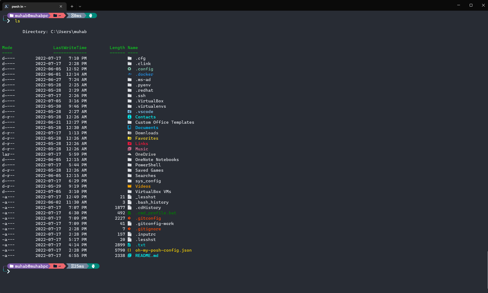
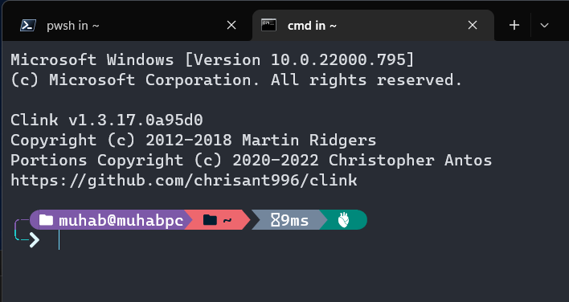

# .cfg

## Overview

Easily manage all your configuration files on your windows machine using a
git bare repo. E.g powershell profile or gitconfig files. In addition to
powering up your powershell and cmd prompt CLI experience using
[oh-my-posh](https://ohmyposh.dev/) and
[clink](https://mridgers.github.io/clink/).

This is my PowerShell CLI:


This is my CMD CLI:


Things I use this repository for:

1. syncing my configuration files across multiple machines.
2. maintaining a list of applications that i discover in case i need to
setup a new machine
3. maintaining useful general purpose powershell scripts and modules that
improve my CLI experience

Good Resources on the subject and where I got my inspiration:

* <https://octopus.com/blog/automate-developer-machine-setup-with-chocolatey#windows-features>
* <https://www.hanselman.com/blog/my-ultimate-powershell-prompt-with-oh-my-posh-and-the-windows-terminal>
* <https://edi.wang/post/2018/12/21/automate-windows-10-developer-machine-setup>
* <https://www.atlassian.com/git/tutorials/dotfiles>

## How to use this repository

First off you should not run any scripts on the internet without first reading
what they do. Once you read through all the scripts and you are happy with the
configuration changes. follow the instructions below.

Instructions:

1. fork this repository then adjust the URL below to your own
repository
2. launch a powershell with elevated privileges
3. `git clone --bare https://github.com/tomoum/.cfg.git $HOME\.cfg`
4. `git --git-dir=$HOME\\.cfg\\ --work-tree=$HOME checkout --force`
5. `git --git-dir=$HOME\\.cfg\\ --work-tree=$HOME config --local status.showUntrackedFiles no`
6. `cd $HOME`
7. `cd .\sys_config`
8. review all the scripts in this directory starting with `windows_init.ps1` and adjust which
ones you want to run based on your needs
9. `.\windows_init`
10. enjoy

>Note:
>**The `--force` flag will delete and replace files that already
exist be careful**

## Misc

Sometimes when deploying this on a new machine i will install choco first in order to install git so i can get started that way.

install choco using the following command:

```shell
Set-ExecutionPolicy Bypass -Scope Process -Force; [System.Net.ServicePointManager]::SecurityProtocol = [System.Net.ServicePointManager]::SecurityProtocol -bor 3072; iex ((New-Object System.Net.WebClient).DownloadString('https://community.chocolatey.org/install.ps1'))
```
